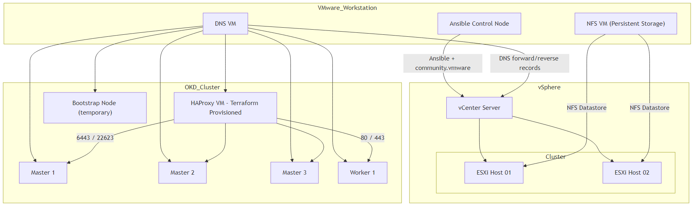

# OKD Infra + OKD UPI Single Flow (2 ESXi Baseline)

This project automates the end-to-end setup of a compact OKD lab on vSphere, combining infrastructure preparation, vCenter workflows, HAProxy provisioning, and OKD UPI installation into one reproducible path.

It is aimed at engineers who want a practical reference for standing up platform infrastructure in constrained lab environments that demonstrates infrastructure-as-code across Ansible, Terraform, Packer, DNS/NFS services, and VMware automation.

In short: the repo exists to reduce the friction of building an OKD-on-vSphere lab while showing the design decisions, sequencing, and operational tradeoffs involved in making that environment work.

This is the single runbook for this repository.
Follow this exact order: `Prereq -> Infra -> OKD`.

## Architecture Overview


## 1. Lab Baseline (Exact Profile Used Here)

- Common infra VMs (used in both layouts):
- `DNS`: `2 vCPU`, `4 GB RAM`, `20 GB disk`
- `NFS`: `2 vCPU`, `4 GB RAM`, `20 GB base disk + 400 GB data disk`
- `HAProxy` (RHEL 9.4): `2 vCPU`, `4 GB RAM`
- `HAProxy` runs inside the same ESXi host capacity (not extra external capacity).
- Shared datastore backend: `nfs` (default path in this repo)
- vMotion enabled
- DRS enabled

Specs with 2 ESXi:
- `2 x ESXi`: per host `12 vCPU`, `52 GB RAM`
- ESXi host capacity subtotal: `24 vCPU`, `104 GB RAM`
- Total ESXi capacity including HAProxy workload: `24 vCPU`, `104 GB RAM`
- Extra external prerequisite VMs (`DNS` + `NFS`): `4 vCPU`, `8 GB RAM`

Nested vSAN disk profile used in this project (only if you choose `storage_backend: vsan`):
- `Hard Disk 1`: `30 GB` (ESXi boot, not in vSAN disk group)
- `Hard Disk 2`: `100 GB` (capacity)
- `Hard Disk 3`: `20 GB` (cache, SSD-marked)
- `Hard Disk 4`: `100 GB` (capacity)

Specs with 1 ESXi (reduced profile):
- `1 x ESXi` physical host in this lab: `12 vCPU`, `82 GB RAM` installed
- On-host VM workload target (single ESXi profile):
  - OKD masters (`3 x 12 GB`) = `36 GB`
  - OKD worker (`1 x 12 GB`) = `12 GB`
  - HAProxy (`1 x 4 GB`) = `4 GB`
  - vCenter (`1 x 14 GB`) = `14 GB`
  - Subtotal on ESXi (steady state, without bootstrap) = `66 GB RAM`
  - bootstrap (temporary during install) = `12 GB`
  - Subtotal on ESXi during bootstrap phase = `78 GB RAM`
- Remaining host memory:
  - Steady state: ~`16 GB` headroom (`82 - 66`)
  - During bootstrap: ~`4 GB` headroom (`82 - 78`)
- External prerequisite VMs (outside ESXi in this lab):
  - `DNS` = `4 GB`
  - `NFS` = `4 GB`
  - `Ansible` = `4 GB`
  - `AD` = `4 GB`
  - External subtotal = `16 GB RAM`

Failure domain note (2-ESXi lab):
- This lab does not provide production-grade control-plane HA under full host failure scenarios.
- It is a functional lab topology, not a full resilience reference architecture.

Total RAM targets (quick reference):
- `1 ESXi layout`: `98 GB` total lab RAM (`82 GB` ESXi host + `16 GB` external VMs: DNS/NFS/Ansible/AD).
- `2 ESXi layout`: `120 GB` total lab RAM (`104 GB` across ESXi hosts + `16 GB` external VMs: DNS/NFS/Ansible/AD).

## 2. Prerequisites

The following infrastructure components must exist before execution:

- Ansible control node
- DNS server VM (static IP)
- NFS server VM if vSAN is not an option (static IP)
- ESXi host(s) reachable from Ansible
- Required network connectivity between all components

`community.vmware` collection must be installed on the Ansible control node.
Secrets must be set (not committed): `vcenter_password`, `esxi_password`, `ad_admin_password`, `okd.pull_secret`.

Warning: The HAProxy VM is provisioned automatically via Terraform during the infrastructure phase.  
It does NOT need to exist beforehand.

## 3. Required Files to Prepare Once

1. Create split vars from examples:
```bash
mkdir -p group_vars/all
cp group_vars/all.example/*.yml group_vars/all/
```

2. Edit split vars with your real values:
- `group_vars/all/core.yml`
- `group_vars/all/vcenter.yml`
- `group_vars/all/okd.yml`
- Important for NFS storage role:
  - `group_vars/all/core.yml -> nfs_vm_storage.pv_disks` must match your actual NFS VM data disk device names.
  - Example `/dev/sdb` is not universal; verify with `lsblk` on your NFS VM before running `lvm_create` / `nfs_conf`.

3. Prepare Terraform vars:
```bash
cp terraform/terraform.tfvars.example terraform/terraform.tfvars
```

4. Edit `terraform/terraform.tfvars`:
- `vsphere_user`, `vsphere_server`
- `datacenter`, `cluster`, `datastore`, `network`, `template_name`
- ignition paths (`bootstrap_ignition_b64_file`, `master_ignition_b64_file`, `worker_ignition_b64_file`)
- node MACs (`bootstrap_mac_address`, `masters[]`, `workers[]`)

5. Vault files expected by infra precheck playbook:
- `vault_vcenter_deploy.yml`
- `vault_ad_connect_user.yml`

## 4. Single Execution Flow

Go/No-Go rule:
- Continue to the next phase only if the precheck report status is `PASS` and readiness gates are `PASS`.
- If precheck status is `FAIL`, do not continue. Fix critical failures first.

1. Infrastructure preparation
- DNS configuration
- NFS configuration
- ESXi validation
- vCenter deployment and configuration

```bash
# Precheck gate
ansible-playbook -i inventory.ini playbooks/06_pre_install_infra.yml --ask-vault-pass
# Continue only if pre-install infra report is PASS
# Optional vCenter lifecycle/configuration flow
ansible-playbook -i inventory.ini playbooks/00_platform_roles.yml
# Core infra host configuration
ansible-playbook -i inventory.ini playbooks/01_core_infra.yml
```

2. Load Balancer provisioning
- HAProxy VM provisioned via Terraform
- Network attachment
- DNS record validation
- HAProxy template used in this lab: `rhel_9.4`
- Prerequisite: Terraform requires an existing VM template in vCenter (`template_name`) before provisioning can run
- If you want template creation to be automated, use **Section 14 (Template Build Automation)**.

```bash
cd terraform/haproxy
terraform init
terraform validate
terraform plan
terraform apply

# after VM provisioning, configure the HAProxy host with Ansible
ansible-playbook -i inventory.ini playbooks/01_core_infra.yml --tags "baseline, haproxy"
```

3. OKD installation
- UPI preparation
- Bootstrap phase
- Control plane deployment
- Worker node join
- OKD version used in this lab: `4.18.0-okd-scos.10`
- VM template used for bootstrap/masters/workers: `fedora-coreos-39.20231101.3.0`
- If you want template creation to be automated, use **Section 14 (Template Build Automation)**.

```bash
ansible-playbook -i inventory.ini playbooks/02_okd_upi_prepare.yml
ansible-playbook -i inventory.ini playbooks/07_pre_install_okd.yml -e preokd_require_ignition_files=true --ask-vault-pass
# Continue only if pre-install OKD report is PASS

cd terraform/okd
terraform init
terraform validate
terraform plan
terraform apply
# VM power sequence (only if your provisioning path does NOT auto-power on)
# 1) bootstrap first
# 2) after ~2 minutes, masters (and workers)
/root/okd-tools/openshift-install --dir /root/okd-install wait-for bootstrap-complete --log-level=debug
ansible-playbook -i inventory.ini playbooks/03_post_bootstrap_haproxy.yml
/root/okd-tools/openshift-install --dir /root/okd-install wait-for install-complete --log-level=debug
ansible-playbook -i inventory.ini playbooks/05_post_install_validation.yml
```

## 5. Notes for This Repo

- Default initial vCenter deployment target is standalone ESXi local datastore (`deploy_storage_type: local_esxi`).
- `playbooks/06_pre_install_infra.yml` loads vault vars from `vault_vcenter_deploy.yml` and `vault_ad_connect_user.yml` via `vars_files`.
- If `platform_roles.vcenter_deploy_enabled=true`, set valid `infrastructure.vcenter.vcsa_ova_file`.
- If you deploy vCenter to NFS at first bootstrap, datastore must already be pre-mounted on standalone ESXi (`deploy_storage_type: nfs_pre_mounted`).
- Use `vmware_debug: true` (or `-e vmware_debug=true`) only for troubleshooting to disable `no_log` in vCenter roles.

## 6. vCenter Component Selection Matrix

Use this matrix to know exactly what the automation will use and how to switch behavior.

| Component | Default behavior | What switches it | Role/Path used |
|---|---|---|---|
| Initial vCenter VM placement | Standalone ESXi local datastore | `infrastructure.vcenter.deploy_storage_type`: `local_esxi` or `nfs_pre_mounted` | `vcenter_deploy` |
| Host networking model | vSS path | `platform_roles.vcenter_configure_vds_enabled=true` enables vDS path | `vcenter_configure_networks` (vSS) or `vcenter_configure_vds` (vDS) |
| VMkernel attachment target | vSS (`vswitch`) | If `vcenter_configure_vds_enabled=true`, VMkernel attaches to `dvswitch_name` | `vcenter_configure_vmkernel` |
| vMotion VMkernel | Disabled by default | `platform_roles.vcenter_configure_vmkernel_enabled=true` and `infrastructure.vcenter.networks.vmotion.vmkernel.enabled=true` | `vcenter_configure_vmkernel` |
| vSAN VMkernel | Disabled by default | Runs only when `storage_backend=vsan` and vsan flags are enabled | `vcenter_configure_vmkernel` |
| Shared datastore type | NFS (project default) | `storage_backend`: `nfs` or `vsan` | `vcenter_create_nfs_datastore` or `vcenter_create_vsan_datastore` |
| vSAN datastore creation | Off by default | `storage_backend=vsan` and `platform_roles.vcenter_create_vsan_datastore_enabled=true` | `vcenter_create_vsan_datastore` |
| NFS datastore creation (post-vCenter) | Off by default | `storage_backend=nfs` and `platform_roles.vcenter_create_nfs_datastore_enabled=true` | `vcenter_create_nfs_datastore` |
| Cluster join timing | Off by default | `platform_roles.vcenter_join_esxi_cluster_enabled=true` | `vcenter_join_esxi_cluster` |
| Licensing | Off by default | `platform_roles.vcenter_add_licenses_enabled=true` | `vcenter_add_licenses` |

Quick profiles:
1. vSS + NFS:
`storage_backend: nfs`, `vcenter_configure_vds_enabled: false`, `vcenter_configure_networks_enabled: true`.
2. vDS + NFS (no vSAN):
`storage_backend: nfs`, `vcenter_configure_vds_enabled: true`, keep `infrastructure.vcenter.networks.vsan.enabled: false`.
3. vDS + vSAN:
`storage_backend: vsan`, enable vDS and vmkernel roles, and set explicit `infrastructure.vcenter.vsan.disk_groups`.

Important:
- With `storage_backend: nfs`, vSAN datastore/vSAN VMkernel are not required unless explicitly enabled.
- If VDS is enabled, VMkernel tasks use `dvswitch_name`; `vswitch` is only fallback for vSS mode.
- If VDS is enabled, you must define `infrastructure.vcenter.vds.host_uplinks` for every ESXi host; otherwise host attach to VDS is skipped/fails and VMkernel creation on dvPortgroups will fail.
- If `storage_backend: vsan`, you must set correct per-host disk mappings in `group_vars/all/vcenter.yml` under `infrastructure_vcenter.vcenter.vsan.disk_groups` using real canonical disk IDs (`naa.*` / `eui.*`) from each ESXi host.
- Placeholder values like `naa.CACHE_DISK_ESXI01` are examples only; wrong mappings will cause vSAN disk-group creation to fail.

## 7. Control Host Requirements

Run commands from a control host that:
- has Ansible installed
- can SSH to target hosts (`dns`, `nfs`, and others used by your flow)
- has network access to ESXi/vCenter endpoints used by enabled roles
- has `community.vmware` collection installed when vCenter roles are enabled

## 8. Validated Versions (Lab Baseline)

- VCSA OVA: `vmware-vcsa-8.0.1.00000-21560480_OVF10`
- ESXi: `8.0U3-24022510`
- Ansible Core: `2.15.x`
- `community.vmware`: `3.11.1`
- `pyvmomi`: `8.0.2.0.1`

Known incompatibility:
- `community.vmware 3.11.1` + `pyvmomi 9.0.0.0` may fail with:
  `No longer supported. Use pyVmomi.VmomiJSONEncoder instead.`

## 9. Inventory Mapping (Minimal Example)

Create your local inventory with `cp inventory.ini.example inventory.ini`.

```ini

[dns]
dns ansible_host=dns.example.local ansible_user=root

[nfs]
nfs ansible_host=nfs.example.local ansible_user=root

[ansible]
ansible ansible_host=ansible.example.local ansible_user=root

[haproxy]
haproxy ansible_host=haproxy.example.local ansible_user=root

[infra:children]
dns
haproxy
nfs

[rhel:children]
dns
haproxy
nfs
ansible
```

## 10. Quick Validation Commands

```bash
# DNS
systemctl status named

# HAProxy
systemctl status haproxy
ss -lntp | egrep '6443|22623|80|443'

# Optional strict prechecks
ansible-playbook -i inventory.ini playbooks/06_pre_install_infra.yml --ask-vault-pass -e preinfra_fail_on_critical=true
ansible-playbook -i inventory.ini playbooks/07_pre_install_okd.yml --ask-vault-pass -e preokd_require_ignition_files=true -e preokd_fail_on_critical=true

# Optional: show full VMware module errors during troubleshooting
ansible-playbook -i inventory.ini playbooks/00_platform_roles.yml --tags vcenter --ask-vault-pass -e vmware_debug=true
```

## 11. Troubleshooting First Checks

- Verify DNS forward resolution for `api`, `api-int`, `*.apps`, bootstrap/master/worker hostnames.
- Verify HAProxy listener ports (`6443`, `22623`, `80`, `443`) are reachable from control host.
- Verify ESXi/vCenter reachability on required API ports.
- Verify ignition files exist and match paths referenced in `terraform/terraform.tfvars`.
- Verify there are no stale SSH host keys when nodes are rebuilt.

## 12. Safe Re-Run Policy

- Precheck playbooks are safe to rerun and produce updated reports.
- Infra/OKD playbooks should be rerun only after fixing reported blockers.
- Keep role toggles (`platform_roles.*`) aligned with intended action before each rerun.
- Treat precheck result as Go/No-Go gate: continue only when status is `PASS`.

## 13. Canonical Documentation

- Use this file (`README.md`) as the canonical single flow.
- Legacy detailed docs are preserved under:
  - `docs/legacy/README_INFRA.md`
  - `docs/legacy/README_OKD.md`
- Pre-publication checks:
  - `docs/PRE_PUBLISH_CHECKLIST.md`

## 14. Template Build Automation

This repo now includes automated template build workflows under `packer/`:

- `packer/okd-template`: Fedora CoreOS OVA -> vSphere template
- `packer/haproxy-template`: RHEL 9.4 ISO unattended install -> vSphere template
- Detailed step-by-step instructions are in `packer/README.md`.

### OKD Template (FCOS OVA)

```bash
cd packer/okd-template
cp okd-template.env.example okd-template.env
# edit values (vCenter, datastore, network, OVA path, template name)
source okd-template.env
bash build_ova_template.sh
```

Default target template name: `fedora-coreos-39.20231101.3.0`.

### HAProxy Template (RHEL ISO)

```bash
cd packer/haproxy-template
# set GOVC_* + ISO_* env vars, then:
bash upload_iso.sh

cp example.auto.pkrvars.hcl auto.pkrvars.hcl
# edit values (vCenter, cluster/datastore/network/folder/template_name)
packer init .
packer validate -var-file=auto.pkrvars.hcl .
packer build -var-file=auto.pkrvars.hcl .
```

Default target template name: `rhel_9.4`.
